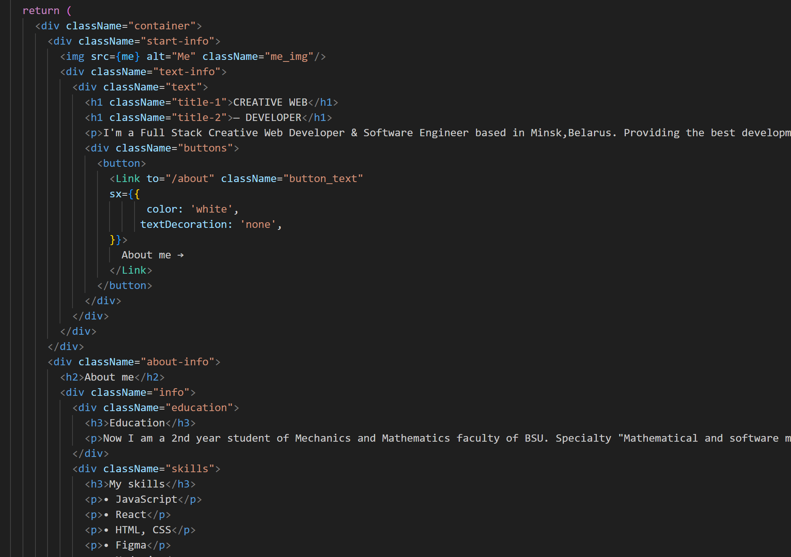

# resume

Добро пожаловать в мое резюме! Этот проект представляет собой интерактивное веб-приложение, где вы можете ознакомиться с моим профессиональным опытом, навыками и образованием. Здесь вы найдете информацию о моих проектах, достижениях и контактные данные для связи со мной.

## Примеры использования

### Просмотр информации

- Посетите раздел "Home", чтобы узнать обо мне, моем образовании и профессиональном опыте.
- В разделе "About" вы найдете все мои навыки и то, что я могу предложить.
- В разделе "Works" представлены некоторые из моих значимых проектов с описанием и ссылками на сайты или демонстрационные видео.

### Связь

- Внизу страницы вы найдете контактные данные, такие как электронная почта и ссылки на профили в социальных сетях.
- Не стесняйтесь связаться со мной, если у вас есть вопросы или предложения.

## Особенности и функциональность

- Разработано с использованием React.
- Адаптивный дизайн, позволяющий просматривать резюме на различных устройствах.
- Интерактивные элементы, такие как анимации и кнопки переключения.

## Благодарности

Я хотел бы выразить благодарность следующим проектам и ресурсам, которые вдохновили и помогли мне в создании этого резюме:

- [GitHub](https://github.com) - платформа для хостинга и управления репозиторием.
